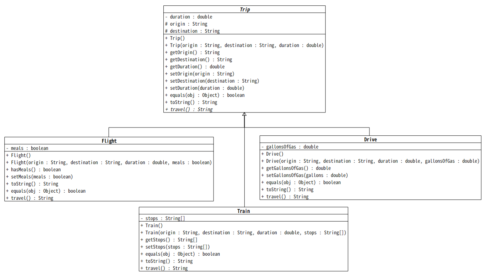

# Lab 5 - Inheritance/Polymorphism and Abstract Classes

## 10/19/2020

## Objectives

1. Be able to code an abstract class
2. Be able to code a child class definition (inheritance)
3. Demonstrate knowledge of how to use the keyword _extends_
4. Demonstrate knowledge of how to code various non-default constructors using superclass constructors
5. Demonstrate knowledge of how to use super() in constructors
6. Demonstrate knowledge of how to use super in other subclass methods

## Exercise

In this assignment, you will be creating a class hierarchy to be used as part of a travel application. The application will read in a list of 'trips' from a file and allow users to view existing trips and create new ones. The application class will be detailed below, but the class hierarchy you should implement is as follows:



Important things to note about this diagram:

* `duration` should always be positive (you can never travel for a negative amount of time)
* In `Drive`, `gallonsOfGas` should also always be positive
* `travel()` should return a string describing the trip. For example, for the `Flight` class, the method could return something like the following:

```
"Flight from 'Chicago' to 'New York City' - 3.5 hours."
```

### TravelApp

Your `TravelApp` class should consist of at least the following four methods:

* `readExistingFile` - This method should read in `travel.csv`, construct the correct `Trip` instance, and return an array of `Trip`s.
* `takeTrips` - This method should take the array of `Trip`s and print out `travel()` for each trip and reset the array of `Trip`s to be empty, i.e. all the trips have been taken, so they no longer need to be tracked.
* `addTrip` - Creates a new `Trip` and adds it to the array of `Trip`s.
* `main` - This method is the standard main method and should contain the menu of options for the user and call all the other methods.

**Note:** Your program should only allow users to have a maximum of 5 trips at any time. If there are more in the file or if the user attempts to create more than 5, simply do not add them to your array.
